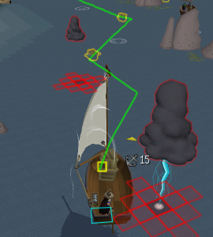

# Barracuda Trial Plugin

A RuneLite plugin for Barracuda Trials. Displays an optimal path to collect lost supplies in order, highlights lightning clouds and their danger zones, shows rocks and speed boost areas, and tracks rum pickup locations. Path calculation uses A\* pathfinding and considers boat position, turning costs, obstacles, and speed boosts. Configurable colors and display options for all overlays.

## Known Issues

- **Difficulty Support:** The plugin has been primarily tested on **Swordfish** difficulty. **Shark** and **Marlin** difficulties have known issues and only partially work - the optimal path feature may behave incorrectly. For these difficulties, you can disable the "Show Optimal Path" option in the plugin settings and still use the other helpful features like supply highlights, cloud danger zones, and rock/boost markers.
- **Pathing sometimes makes weird choices**, especially mid-route. Ignore suggestions to go backwards.
- **Rum pickup/dropoff highlighting is not working.** The locations are tracked but not rendered correctly.
- **Debug mode needs cleanup.** Once everything is stable, debug logging and performance tracking should be removed.

## Problem & Approach

### Barracuda Trials

Barracuda Trials requires completing 1-3 laps (depending on difficulty) around a circular route. Each lap follows the same pattern:
- Start at the **Rum Dropoff** (north)
- Sail around collecting **Lost Supplies** (scattered on west and east sides)
- Stop at the **Rum Pickup** (south) to collect rum
- Continue collecting more Lost Supplies
- Return to the **Rum Dropoff** (north) to complete the lap

The critical constraint: **all Lost Supplies must be collected before delivering the rum on the final lap.** Additionally, supply locations are unknown at the start of each race - they spawn randomly at one of several possible locations and are only discovered as you sail past them.

### The Optimization Problems

This creates several interconnected challenges we attempt to solve:

1. **Multi-lap planning**: How should we distribute supply collection across multiple laps to minimize total sailing time?
2. **Unknown locations**: Since supplies spawn randomly each race, we can't plan the optimal route until we've discovered where they all are
3. **Collection ordering**: Within each lap, what order should we visit the supplies to minimize backtracking?
4. **Real-time navigation**: Lightning clouds move erratically and must be avoided during actual navigation

### Our Approach

We attempt to solve these problems using a combination of algorithms:

- **Multi-lap optimization**: We try multiple partitioning strategies to distribute supplies across laps, testing different spatial clustering and distribution approaches to find the arrangement with the lowest total estimated cost
- **Supply collection ordering**: For each lap, we use **Nearest Neighbor** greedy selection followed by **2-Opt local search** to attempt to solve the traveling salesman problem of visiting all assigned supplies efficiently
- **Strategic distance estimation**: We precompute approximate distances between all supply pairs using straight-line distances with penalty multipliers for paths that cross obstacles or dangerous areas
- **Tactical pathfinding**: We use **A\* pathfinding** (configured as Dijkstra to handle negative costs from speed boosts) to navigate the actual tile-by-tile path between waypoints while avoiding rocks, clouds, and the exclusion zone
- **Adaptive replanning**: As supplies are discovered during sailing, we attempt to reform the plan dynamically - typically having complete information after the first lap to optimize the remaining laps

The goal is to balance long-term strategic planning (which laps collect which supplies) with short-term tactical navigation (avoiding moving obstacles) while adapting to the gradually-revealed supply locations.
